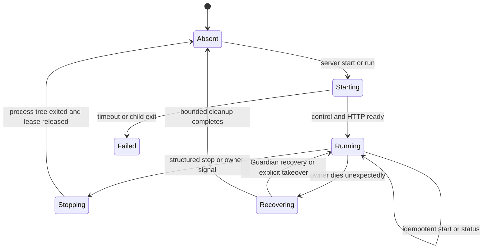

# Remote Runtime and Access

This guide owns OpenAlice's remote Runtime architecture: server lifecycle,
local and remote client responsibilities, SSH transport, managed remote
bootstrap, control/status contracts, multi-client authority, and the staged
path toward an independent Studio frontend.

Start with [[docs/remote-quickstart.md]] for the user-facing setup and daily
workflow. This owner guide complements [[docs/local-runtime.md]],
[[docs/cli-supervisor.md]],
[[docs/docker-deployment.md]], and [[docs/managed-workspace-runtime.md]]. The
Herdr comparison that informed this design is recorded in
[[docs/reference/herdr-remote-architecture.md]]. That reference is research;
this guide is the OpenAlice contract.

## Status

The repository now contains the Bun-native Stage 0 through Stage 2 path, with
source checkout support retained only as an explicit development override:

- `openalice up|run` re-executes the installed native command into the existing
  Guardian/Alice/UTA/Connector process roles without requiring Node, Bun, a
  checkout, or a current working directory;
- `openalice start` remains a compatibility entry point and follows the same
  installed-Runtime preference;
- `openalice up|run|status|open|down` provides the canonical local Shell
  lifecycle and presentation over the same `cli-server` Guardian owner;
- `openalice ssh <target>` creates a loopback SSH tunnel to an already-running
  remote OpenAlice Runtime;
- `openalice server run|start|status|stop` provides a browserless foreground or
  detached Runtime lifecycle backed by Guardian's local control endpoint;
- `openalice remote <target>` probes, plans, installs the matching native CLI
  release when approved, starts or reuses the remote Server, and opens the same
  loopback tunnel; an explicit `--app-dir` remains the source-development path;
- `openalice machine list|add|remove|inspect` owns an explicit local registry
  of SSH hosts and reads each compatible host's registered AliceProjects with
  one bounded aggregate SSH command;
- `openalice project transfer` plans and copies one quiescent local
  AliceProject into a new complete home on a registered SSH Machine, preserving
  portable configuration and Workspace repositories while deliberately
  starting with zero resumable Sessions;
- `Dockerfile.railway` provides a volume-backed native CLI SSH host whose
  foreground `server run` process is supervised by Railway while the browser
  still connects only through an SSH loopback tunnel;
- Electron remains a complete local desktop distribution.

The release-owned installer advances one checksum-bound native OpenAlice
release. Agent Runtime executables remain user-owned and are only discovered
from the remote host's `PATH`. The clean Docker SSH acceptance covers native
download, install, multi-process startup, AliceProject transfer, and the tunnel
loop on a host with no Node, Bun, or Agent Runtime installed. Real long-latency
Agent TUI measurements remain a separate release observation rather than a
reason to invent a new terminal protocol preemptively.

## Product Decision

OpenAlice has four first-class entry surfaces, not one replacement chain:

| Surface | Presentation runs | Runtime runs | Purpose |
|---|---|---|---|
| Electron | local packaged app | local Electron-owned Runtime | complete desktop distribution |
| Local browser | local browser | local Guardian-owned Runtime | low-friction CLI distribution and development |
| SSH browser | local browser | remote Guardian-owned Runtime | same product over an authenticated transport |
| Independent Studio | local or hosted web client | local, remote, or managed Runtime | later presentation-neutral client |

Electron must remain complete. The CLI/server path is an additional
distribution and remote-control surface; it does not replace Electron's
`app://` protocol, preload/IPC, packaged PTY, signing, updater, or managed
runtime behavior.

The first remote product reuses the normal OpenAlice browser application over
an SSH loopback tunnel. This already keeps the expensive and security-sensitive
work on the remote host while rendering HTML locally. A new hosted Studio
protocol is deferred until the local/server boundary is stable.

## Vocabulary

- **Runtime**: the Guardian-owned process tree and user state under one
  `OPENALICE_HOME`. It includes Alice, optional UTA, optional Connector Service,
  workspaces, PTYs, native Agent CLIs, schedules, and file-backed state.
- **Server**: a Runtime deliberately started without owning a browser or
  terminal client. It continues after the command that requested detached
  startup exits.
- **Client**: a presentation or control surface: browser, Electron renderer,
  installed CLI, or future independent Studio.
- **Transport**: how a client reaches a Runtime. The first remote transport is
  OpenSSH; it is not part of Runtime state.
- **Control endpoint**: a user-local, non-network endpoint owned by Guardian for
  status and graceful shutdown. It is distinct from Alice HTTP, MCP/CLI, UTA,
  Connector, and PTY WebSocket endpoints.
- **Presentation protocol**: HTTP/WS for the current browser, Electron IPC for
  the packaged app, and a future versioned snapshot/event protocol for an
  independent Studio.

## Architectural Invariants

1. The machine that owns the files owns the Workspace, native Agent processes,
   tool execution, provider requests, and trading boundary.
2. Guardian remains the final single-writer and process-tree authority for an
   `OPENALICE_HOME`; a new CLI command may not invent a parallel lock.
3. UTA remains optional. Server, remote status, browser Chat, and non-trading
   work must function in lite/read-only mode.
4. Alice binds to `127.0.0.1` for local and SSH-backed server use. Internal
   MCP/CLI, UTA, Connector, control, and PTY ports are never made public to
   enable remote access.
5. SSH authenticates and encrypts transport. It does not silently grant
   install, update, start, takeover, or stop consent.
6. Disconnecting a browser, Electron renderer, CLI, or SSH tunnel does not stop
   a detached Server.
7. top-level `down` and compatibility `server stop` ask the owning Guardian to
   terminate its own tree and verify completion. They do not signal a guessed
   PID or delete a live lock.
8. `--takeover` remains the only command-line authority to replace another
   recorded Guardian owner.
9. On an ordinary SSH-managed host, remote bootstrap reuses the invoking local
   CLI's recorded installer source and logical release identity. Stable, beta,
   and pinned installs may use different target archives for different
   operating systems or architectures; each host verifies its own archive
   checksum and content identity. Dev additionally requires the invoking CLI to
   match the latest completed dev manifest and selects the remote target from
   that same manifest. Bootstrap does not carry a second SSH-only installer,
   upload Runtime bytes through SSH, install Node/build tools, clone a checkout,
   or install an Agent Runtime. Only an explicit `--app-dir` opts into source
   preparation. A Railway host is platform-managed instead: its entrypoint and
   service variables select the release, while the laptop only inspects the
   resulting target-local CLI and Runtime identity.
10. Shared Runtime facts use presentation-neutral names and versioned schemas.
    Browser layout, Electron chrome, modal state, and other client UI state do
    not become server truth.

## AliceProject Transfer

The first transfer direction is local AliceProject to a registered SSH
Machine. `--plan` inventories without changing either host; apply requires an
explicit confirmation or `--yes`. The source remains registered and unchanged,
and the destination receives a new AliceProject id. Transfer never means
takeover, move, merge, replacement, deletion, Runtime start, or default-project
selection.

```bash
openalice project transfer \
  --from research \
  --to-machine cloud-dev \
  --to-project research-cloud \
  --to-home /home/alice/.openalice-research \
  --session-owner-policy keep-blocked \
  --plan
```

The plan reports portable file/byte totals, required destination free space,
secret-free credential categories, excluded Session/runtime files, and exact-
Session scheduled Issues. Apply re-probes source ownership and remote inventory,
requires a stopped source (or the separate `--stop-source` authority), and
refuses an occupied project key or Home.

The sender uses a versioned, bounded stream over SSH stdin. The receiver checks
normalized paths, entry types, symlink containment, sizes, checksums, available
space, and transaction identity; writes an owner-private sibling staging Home;
then atomically publishes and registers it without changing the remote default.
A matching published receipt makes registration retry idempotent. Cancellation
terminates the SSH receiver and leaves only that transaction's marked staging
path eligible for a safe retry.

Portable configuration, active and departed Workspace repositories, Workspace
ids, and lifecycle records transfer. Absolute Workspace paths are rebased to
the remote Home. For an ordinary self-contained Git Workspace, the planner
keeps portable object/ref/index state, tracked files (including deliberately
tracked ignored files), and nonignored untracked user files; machine-local Git
configuration plus ignored untracked dependencies and build outputs stay
behind. Linked worktrees, alternate/promisor object stores, nested Git
repositories, and initialized submodules block apply instead of being silently
degraded. A non-Git Workspace remains portable subject to the same Session,
symlink, and machine-local exclusions.

Guardian state, Runtime payloads, ports, Web auth and sessions,
headless/native conversation state, resume identities, native Agent login and
configuration, and untracked Session dossiers do not transfer. A deliberately
Git-tracked `.alice/sessions` dossier remains inert repository content and does
not create a resumable remote Session. Top-level `bin/` and `cli/` trees,
installer locks/caches, and Alice-owned backup families are excluded; an
arbitrary backup file deliberately stored inside a user repository still
follows that repository's Git rules. Absolute symlinks, symlinks containing
control characters, and relative symlinks that resolve outside the source
AliceProject Home are reported as machine-local exclusions. Portable relative
symlinks contained by the Home remain part of the transfer.

Only Alice-owned AI, market-data-provider, broker, and Connector credentials
can travel in the private SSH stream. Broker and Connector values are decrypted
in source-process memory and sealed on the receiver with a newly created
destination key; the source sealing key is never copied. With
`--without-credentials`, portable AI and market-data configuration remains
after secret fields are stripped, while broker-account and Connector credential
files are omitted and must be configured again. Web authentication and native
Agent login remain separate destination setup in either mode. Exact-Session
scheduled Issue owners require an explicit `keep-blocked` or `new-then-resume`
policy.

## Layered Topology

```text
presentation plane
  browser | Electron | future Studio
        │
transport plane
  loopback HTTP/WS | Electron IPC | SSH loopback | future capability channel
        │
runtime/control plane
  Guardian lease + local control endpoint + Alice APIs
        │
execution plane
  Workspace files + PTYs + native Agent CLIs + tools + optional UTA
```

The boundary matters when debugging latency. In an SSH-browser session, the
browser is local but the shell/TUI and model loop are remote. Keystrokes cross
the network to the remote PTY; remote screen changes return over the Workspace
WebSocket. HTML layout, menus, lists, and most Studio interaction remain local
browser work.

## Command Contract

### Existing local and transport commands

```bash
openalice start [app-dir]
openalice ssh <target>
```

`openalice start` is an interactive foreground convenience command. It prepares
the source checkout, starts Guardian, opens the browser unless `--no-open` is
set, and stops its Runtime when the command receives a termination signal. If a
healthy Runtime already owns the requested home and port, it reuses that URL
instead of replacing the owner.

`openalice ssh` is a pure transport command. It chooses a free local loopback
port, forwards it to the remote Alice loopback port, optionally opens the
browser, and stays in the foreground to own the tunnel. It never installs,
updates, starts, stops, or takes over the remote Runtime.

### Server lifecycle

```bash
openalice run [app-dir]
openalice up [app-dir]
openalice status
openalice open
openalice down

# compatibility surface used by managed remote and existing scripts
openalice server run [app-dir]
openalice server start [app-dir]
openalice server status
openalice server stop
```

The top-level lifecycle is canonical for direct Shell use. The `server`
commands remain its compatibility presenter because managed remote must keep
working across CLI upgrades. Both families operate the same `cli-server`
Guardian owner and accept the same explicit `--home`, `--port`, and source
checkout selection as local start. `run`, `up`, and `server start` also accept
`--rebuild` and `--takeover` where the existing start contract does.

| Command | Lifetime and side effects |
|---|---|
| `server run` | foreground Guardian; no browser; logs remain attached; signals cascade through Guardian |
| `server start` | idempotent detached start; waits for control and HTTP readiness before succeeding; never opens a browser |
| `server status` | read-only probe; human output by default and stable `--json` for orchestration |
| `server stop` | structured local stop request to the matching CLI Server, followed by a bounded wait for tree and endpoint exit |

`server start` has three valid outcomes:

1. **started**: it prepared the Runtime, detached it, and observed readiness;
2. **already running**: the requested CLI Server was already healthy and
   compatible, so no process was replaced;
3. **owned elsewhere**: another launcher or incompatible owner holds the
   Guardian lease. The command reports the owner and exits without mutation.

Only an explicit `--takeover` may turn the third result into replacement. A
normal start must never interrupt an Electron session, another checkout, a
Docker-owned home, or a healthy CLI foreground start.

`server stop` is deliberately narrower than takeover. It stops a Runtime only
when the reachable control endpoint proves that it is the requested CLI Server
for the same canonical home. If Electron or another launcher owns the lease but
does not advertise that control contract, status reports `owned_elsewhere` and
stop refuses. The user may then close that surface normally or make a separate
explicit takeover decision.

On a service-managed host, `server run` stays in the foreground so Guardian is
the service's observed process rather than a detached child hidden behind an
idle container. The platform owns container restart and replacement. A
Railway-identified target is therefore status/connect-only through
`openalice remote`: `--stop`, `--takeover`, and `--app-dir` are rejected, and
the operator changes lifecycle or release selection through Railway. Inside
Railway SSH, the image-owned wrapper replaces every persistent command shim on
startup and routes `update`, `rollback`, and `uninstall` back to service
configuration before an installed release can change the persistent pointer
beneath a running foreground Runtime.

### Managed remote command

```bash
openalice remote <target>
```

`openalice remote` is orchestration around the same Server and SSH contracts:

1. verify ordinary SSH connectivity and host-key policy;
2. detect remote platform, home, and an installed `openalice` CLI;
3. select the compatible Runtime embedded in the installed native CLI release,
   or the explicit source checkout named by `--app-dir`;
4. probe `openalice server status --json`, Runtime provider state, and protocol
   compatibility;
5. on an ordinary SSH-managed host, compare stable, beta, or pinned installs by
   logical release, then validate the remote target's own platform,
   architecture, archive checksum, content identity, and embedded Runtime
   identity; for dev, first require the invoking CLI to match the latest
   completed dev manifest and bind the remote target to that same manifest;
6. if CLI install or update is required, show the exact matching plan and ask
   separately before calling the normal installer on the remote host;
7. re-probe and re-plan after installation so a newly visible owner can block
   or require a second explicit takeover decision;
8. when `--app-dir` is explicit, validate and prepare that user-selected source
   checkout without turning it into a second default distribution path;
9. run `openalice server start` with the selected installed Runtime or explicit
   source root and wait for readiness;
10. create the same loopback tunnel used by `openalice ssh`;
11. reuse the last successful local port for this target and remote home when it
   is available, so an existing browser tab can reconnect to the same origin;
12. open or print the local URL and stay in the foreground to own only the
    tunnel.

Railway is the explicit exception to release-selection and mutation steps 5–9.
Its service variables, entrypoint, deploy, and restart policy are the sole
release/lifecycle authority. The laptop does not fetch a dev manifest or
compare the service release to its own CLI. `openalice remote` verifies that the
platform-managed installed CLI, target-local provenance, embedded Runtime,
running provider, and configured selector are self-consistent; a verified
previous-release fallback is reported distinctly. It then opens the same
loopback tunnel without installing, updating, starting, taking over, or stopping
the service.

When reusing a healthy Server, `remote` takes the loopback web port from the
versioned status response. An explicitly supplied `--remote-port` must match
that owner; a mismatch is reported before opening a misleading tunnel.

On an ordinary SSH-managed host, closing `openalice remote` closes the tunnel
but leaves the detached remote Server running. Status and stop remain explicit
and do not require users to compose raw SSH commands:

```bash
openalice remote <target> --status
openalice remote <target> --stop
```

Neither command conflates “disconnect” with “stop my remote work.” A Railway
foreground Server also survives tunnel closure, but Railway owns its lifecycle
and `openalice remote --stop` is rejected.

### Railway native CLI SSH host

Railway is a deployment profile of the same SSH/browser product, not a public
Web deployment and not a second remote protocol. `Dockerfile.railway` builds a
small service image with OpenSSH client utilities, the shared Bash installer,
and `scripts/railway/entrypoint.sh`. The image does not contain an OpenAlice
native release or an Agent Runtime. At boot the entrypoint installs or reuses a
verified native release on the attached volume, then replaces itself with:

```bash
openalice server run --home /data/projects/default --port 47331 --wait 180
```

The required persistent layout keeps machine installation and AliceProject
state distinct:

```text
/data/
├── home/
│   ├── .openalice/       # native CLI install root and immutable releases
│   ├── .local/           # persistent user-owned package/bin prefix
│   └── .bun/             # optional user-owned Bun installation
└── projects/
    └── default/          # OPENALICE_HOME
        └── workspaces/   # AQ_LAUNCHER_ROOT
```

The Railway Volume is fixed at `/data`. The image exposes the persistent SSH
`HOME=/data/home`, OpenAlice install root, npm prefix, Bun root, and their
executable directories on `PATH`, so a fresh Railway SSH shell sees the same
user installation as Guardian. Bootstrap temporarily replaces that `PATH` with
system directories only, validates the fixed user layout, and restores the
persistent paths only after the native CLI is verified. Operators may select
only `OPENALICE_HOME`, which must resolve beneath `/data`; `AQ_LAUNCHER_ROOT` is
always derived as `<OPENALICE_HOME>/workspaces`. `HOME`, install root, npm/Bun
roots, Volume root, and `AQ_LAUNCHER_ROOT` are not independent profile options.
A normalized `..` or symlink escape is refused, and a Railway environment
without the `/data` Volume fails before installation.
Stable is the default bootstrap channel; beta may be pinned to an accepted beta
version, stable may be pinned to an accepted stable version, and rolling dev
does not accept a version override. Stable and beta reuse a verified matching
release unless refresh is explicitly requested. Rolling dev always asks the
shared installer to resolve the latest completed dev manifest. If a requested
refresh fails, the exact previously verified release remains the fallback; an
empty or damaged install fails closed.

The service must not publish Alice's port or attach a Railway public domain.
The laptop reaches it through Railway's SSH target and the ordinary
`openalice remote` loopback tunnel. Agent Runtime executables, credentials, and
updates remain user-owned: install them through an SSH shell into persistent
user paths such as `/data/home/.local/bin` or `/data/home/.bun/bin`, both of
which the entrypoint includes on `PATH`. Missing Agent Runtimes do not make the
OpenAlice host bootstrap incomplete.

### Registered Machines and aggregate inventory

`openalice machine` adds durable fleet identity without changing the existing
raw-target `openalice remote <target>` contract:

```bash
openalice machine list [--json]
openalice machine add cloud --target alice@example.com [--ssh-port 22]
  [--identity ~/.ssh/cloud] [--name "Cloud"] --yes
openalice machine remove cloud --yes
openalice machine inspect [cloud] [--json]
```

The implicit `local` Machine cannot be removed. SSH rows live in the
machine-wide Supervisor root's owner-private `machines.json`; they contain a
display name, OpenSSH target, port, and optional local identity-file path, but
never passwords, private-key bytes, passphrases, host keys, agent material, or
remote credentials. OpenSSH config, agent, ProxyJump, and host-key policy stay
authoritative. Removing a row forgets local metadata only and never connects
to or mutates the host.

`machine inspect` uses the same typed inventory for local and remote Machines.
Each remote probe invokes `openalice machine inspect local --json` once; that
remote command reads only its Supervisor AliceProject registry and probes those
registered complete homes. Fleet probes force OpenSSH batch mode so a password,
key-passphrase, or host-key prompt cannot seize the Supervisor TUI; those cases
become an `unauthorized` row. Interactive tunnel commands retain normal
OpenSSH prompting. The inventory command does not scan other directories. The bounded
response contains project identity, product, home/port, normalized Runtime
state, safe component health, and advertised capabilities. Runtime owner PIDs,
tokens, logs, command lines, environments, and credentials are omitted.

Reachability is deliberately not Runtime state. A registered remote row is
reported as `online`, `offline`, `unauthorized`, or `incompatible`; an online
Machine may still contain stopped, unhealthy, or differently owned Projects.
One unreachable Machine remains a row in the fleet result instead of failing
the complete refresh. `remote-targets.json` continues to be only the hashed
ephemeral local-port cache used by tunnels and is not a Machine registry.

The Supervisor Fleet page consumes that contract directly. A running remote
AliceProject with a validated `127.0.0.1` Web endpoint can be opened through
the existing loopback tunnel. The TUI owns an abort controller for every such
tunnel: `q`, `Esc`, `Ctrl+C`, or process termination closes the tunnel while
leaving Guardian and the detached remote Server untouched. `s` may start a
stopped compatible Project, but only after a fresh aggregate inventory and
Machine-registry read prove the selected key is still stopped, available, and
lifecycle-capable. The command then invokes the registered SSH target and
refreshes Fleet state. Stop, restart, takeover, Setup, source, logs, Doctor,
and configuration mutations remain unavailable for remote Fleet selections;
offline or incompatible rows never receive guessed lifecycle actions.

When `--app-dir` is absent, managed remote requires the verified native Runtime
installed with the matching CLI. No Git checkout, Node, Bun, Python, compiler,
or package-manager mutation is part of that path. A target outside the
published platform/architecture matrix is reported as unsupported instead of
silently changing distribution models. An explicit `--app-dir` is user-owned:
it may be prepared as source, but existing source is never fetched, switched,
reset, or overwritten merely to imitate the native release.

`--yes` may approve the displayed install/update/start plan for automation, but
it never implies `--takeover`. Non-interactive execution without a sufficient
explicit approval fails without remote mutation.

The remembered local port is user-local connection state, not remote Runtime
state. An explicit `--local-port` wins. If an automatically remembered port is
already occupied, `remote` reports the conflict, allocates a free loopback port,
and remembers the replacement only after the tunnel passes OpenAlice readiness.

The browser also needs enough client-owned identity to explain a tunnel outage
after the remote Runtime becomes unreachable. `openalice ssh` and
`openalice remote` therefore open the local UI with a short-lived URL fragment
containing only the validated SSH destination, SSH port, and remote loopback
Runtime port. The Web UI consumes that fragment into tab-scoped session storage
before rendering and immediately removes it from the address bar. Fragments are
not sent in HTTP requests, so this context never becomes remote Runtime state or
server log data. The global offline screen may use it to distinguish a broken
SSH route from a local Runtime outage and show the exact endpoints to retry.

## Server Lifecycle



The readiness barrier includes:

- Guardian owns the canonical runtime lease;
- the local control endpoint responds with a compatible protocol;
- Alice reports healthy on its loopback HTTP endpoint;
- optional components report their own state without making UTA a readiness
  requirement for non-trading use.

The detached parent returns success only after this barrier. On timeout it
prints the isolated log path and current ownership evidence. It must not report
success merely because a child PID was spawned.

The Server appends Guardian and child output beneath the selected
`OPENALICE_HOME` and prints that path on start. Logs must not contain provider,
broker, SSH, pairing, or sealing secrets.

## Guardian Control Contract

### Endpoint

The Unix endpoint is normally
`<OPENALICE_HOME>/state/guardian-control.sock`, mode `0600`. If that path would
exceed the conservative Unix-domain-socket byte limit, both Guardian and the
CLI derive a per-home hashed filename beneath a UID-owned `0700` directory in
the OS temporary root. Native Windows derives an equivalent per-home named
pipe. Every form is deterministic for the canonical home and is removed only
when the closing Guardian still sees the socket identity it created.

The endpoint is never bound to TCP and is never forwarded by `openalice ssh`.
Remote orchestration reaches it only by executing the remote CLI through SSH.

Stale path handling follows reachability and ownership, not existence alone:

1. connect and perform a versioned status request;
2. if reachable, treat it as an owner regardless of a surprising PID file;
3. if unreachable, consult the Guardian lease/recovery state;
4. remove a stale endpoint only while acquiring ownership for a new Guardian;
5. never unlink an endpoint merely because status timed out once.

### Versioned messages

The control protocol is newline-delimited JSON with a small, bounded request
size. Every request and response carries `protocol` and `id`. Initial methods:

- `runtime.status` — read-only readiness, ownership, version, endpoints, and
  component health;
- `runtime.stop` — acknowledge intent, begin the normal Guardian shutdown
  cascade, and close the endpoint only after shutdown begins.

The status result is presentation-neutral and includes at least:

```json
{
  "protocol": 1,
  "runtimeVersion": "<OpenAlice version or dev identity>",
  "state": "running",
  "home": "<canonical OPENALICE_HOME>",
  "owner": {
    "surface": "cli-server",
    "pid": 1234,
    "instanceId": "<Guardian instance id>",
    "startedAt": "<ISO-8601>",
    "launchRoot": "<native release resource root or explicit source root>"
  },
  "endpoints": {
    "web": "http://127.0.0.1:47331"
  },
  "components": {
    "alice": "ready",
    "uta": "disabled",
    "connector": "disabled"
  },
  "capabilities": ["runtime.stop"]
}
```

Human `server status` output may be friendly, but `--json` preserves this
machine-readable meaning and stable exit classes:

| Class | Meaning |
|---|---|
| `running` | compatible CLI Server is ready |
| `starting` / `stopping` | matching owner is in a transitional state |
| `absent` | no reachable control endpoint and no live Guardian owner |
| `owned_elsewhere` | Guardian evidence exists, but it is not a matching controllable CLI Server |
| `incompatible` | endpoint is reachable but protocol/runtime compatibility fails |
| `unhealthy` | matching owner exists but readiness checks fail |

Status must not return credentials, auth tokens, complete environment
variables, arbitrary command lines, or private internal-port URLs.

### Shutdown and recovery

`runtime.stop` enters the existing Guardian shutdown path:

1. stop accepting new control mutations;
2. send the normal graceful signal to children;
3. wait the existing grace period;
4. escalate through Guardian's process-tree policy when required;
5. wait for children and the recorded owner to exit;
6. release only the lease and control endpoint owned by this instance.

If the control endpoint is unreachable but a lease exists, `server stop` does
not improvise cleanup. Recovery remains the existing explicit Guardian
takeover path with its discover → TERM → grace → tree KILL → owner-exit order.

## SSH Transport Contract

The current transport remains intentionally boring:

```text
local browser
  └── http://127.0.0.1:<random-local-port>
        └── ssh -L 127.0.0.1:<local>:127.0.0.1:<remote>
              └── remote Alice HTTP + Workspace PTY WebSocket
```

Alice, the Workspace, Agent CLI, shell, provider calls, and tools run on the SSH
host. The browser loads the normal OpenAlice bundle through the tunnel, so
HTTP, authentication, and Workspace WebSockets stay on one local loopback
origin. No public domain, hosted-cookie bridge, relay, or second frontend
protocol is required.

`openalice ssh` and the tunnel phase of `openalice remote`:

- bind only local `127.0.0.1`;
- target only remote `127.0.0.1`;
- use the user's ordinary OpenSSH config, agent, keys, ProxyJump, and host-key
  verification;
- preserve interactive SSH authentication when a terminal is available;
- use keepalives without overriding stronger user config;
- buffer transient command stderr while retrying, so provider control-plane
  noise is shown only if the connection ultimately fails;
- exit clearly when the local port cannot bind or the remote forward fails;
- for managed `openalice remote`, prefer the last successful per-target local
  port so the old browser origin can recover after a tunnel reconnect, and
  visibly fall back when that port is occupied;
- never disable host-key checking;
- never expose the Guardian control endpoint.

Before diagnosing an OpenAlice error, users should be able to verify
`ssh <target>` independently. Managed remote may reuse an SSH ControlMaster in
a private user-only temporary directory, but it must clean up only the control
socket it created.

## HTTP and Browser Security

SSH makes the remote HTTP request arrive from loopback, so network origin alone
is not sufficient authorization. The browser contract remains:

- the UI, HTTP API, and PTY WebSocket share the tunnel's local loopback origin;
- Alice accepts loginless local behavior only for no-`Origin` local CLI/server
  callers, a validated loopback browser origin, or the exact packaged
  `app://openalice` origin;
- public web origins cannot inherit localhost trust merely because a tunnel is
  open;
- state-changing requests and WebSocket upgrades keep origin validation;
- `OPENALICE_DISABLE_AUTH=1` is never a remote-access instruction;
- a deployment intentionally exposed beyond loopback follows
  [[docs/docker-deployment.md]] and its normal HTTPS/auth boundary.

The future independent Studio cannot reuse “it arrived from loopback” as its
identity. It needs an explicit pairing/capability flow with revocation,
least-privilege scopes, origin binding, and a user-visible device/session list.
That is a later protocol, not a shortcut in the SSH phase.

## Terminal and Agent Streaming

### Stage-one behavior

The existing Workspace PTY WebSocket crosses the SSH tunnel unchanged. The
remote PTY and Agent TUI remain authoritative; the local xterm-compatible
surface renders received terminal bytes. Shell, Claude Code, Codex, opencode,
and Pi retain the same terminal semantics. WebPi remains an optional structured
Pi surface, not a prerequisite or replacement for shell/TUI workflows.

This path should be measured before adding a second terminal protocol. Relevant
tests use controlled network conditions such as 20 ms, 80 ms, and 150 ms RTT,
low-bandwidth links, bursty Agent redraws, resize, reconnect, and long-running
output. Record:

- input-to-first-visible-output latency;
- bytes transferred during representative Agent interactions;
- whether stale output accumulates after a burst;
- reconnect and scrollback behavior;
- CPU and memory on both ends;
- behavior when the tunnel disappears mid-command.

Round-trip latency cannot be removed while the Agent process is remote. The
design goal is to avoid adding avoidable backlog, excessive redraw bandwidth,
or remote presentation work on top of that RTT.

### Structured terminal optimization, if evidence requires it

If raw PTY traffic creates meaningful backlog or bandwidth cost, add a
terminal-specific stream behind stable Workspace/Session/terminal identities:

- server parses terminal bytes into current VT state;
- clients negotiate full snapshot plus incremental updates;
- each frame has a monotonic sequence and explicit dimensions;
- control messages remain reliable and ordered;
- render updates are bounded latest-state data, not an unbounded reliable
  queue;
- a gap or incompatible baseline triggers a fresh snapshot;
- only an acknowledged or queued frame advances the per-client baseline;
- observers cannot send input or resize;
- one controller owns input and resize, with explicit takeover.

This stream optimizes terminals only. Studio navigation, data tables, settings,
Inbox, Workspace metadata, and trading UI continue to use presentation-neutral
application APIs rather than a remote-rendered framebuffer.

## Multi-Client Authority

The first SSH-browser release may support one interactive browser per terminal,
but the contract reserves explicit roles:

| Role | Read output | Send input | Resize PTY | Take ownership |
|---|---:|---:|---:|---:|
| observer | yes | no | no | no |
| controller | yes | yes | yes | no |
| takeover requester | after grant | after grant | after grant | explicit only |

For a given terminal there is at most one controller. A second browser,
Electron client, or future Studio may observe without changing the PTY size.
Control transfer is visible and deliberate; it is not awarded silently to the
last socket that sends a resize.

Client-local effects stay client-local:

- clipboard reads/writes target the controlling local surface;
- notifications name the Session and source client policy;
- window size and focus are not durable Runtime facts;
- reconnect does not imply takeover;
- disconnect releases transient controller ownership after a bounded grace
  period, but does not kill the PTY or Agent.

Shared Runtime facts include Workspace and Session identity, terminal identity,
Agent process/session metadata, execution status, artifacts, and file-backed
state. They must not be named after a particular sidebar, card, tab strip, or
Electron window.

## Persistence Semantics

Remote documentation must distinguish what survived:

| Event | Guardian tree | PTY process | recent terminal state | Agent conversation |
|---|---:|---:|---:|---:|
| browser/tunnel disconnect | survives | survives | live in PTY Runtime | survives because process lives |
| controller transfer | survives | survives | live in PTY Runtime | survives because process lives |
| Alice child restart under Guardian | Guardian survives | depends on current PTY ownership path | implementation-dependent | native Agent process/session dependent |
| full Guardian/server restart | stops and restarts | does not automatically survive | only persisted history, if explicitly supported | only through native Agent resume/provenance |
| machine reboot | stops | stops | only persisted history | only through native Agent resume/provenance |
| Railway container replacement with the same Volume | foreground Guardian restarts | stops | only persisted history | only through native Agent resume/provenance |

OpenAlice must not market server detach as crash-proof terminal persistence.
Conversation provenance and native CLI resume remain governed by
[[docs/conversation-provenance.md]]. Persisting terminal scrollback is a
separate privacy decision because screens can contain source, prompts, output,
tokens, or account data.

Live PTY handoff during Runtime upgrade is explicitly deferred. The first
managed remote version may require a visible stop/restart when protocols are
incompatible. It must describe the effect before acting.

## Managed Remote Bootstrap and Compatibility

Ordinary SSH-managed bootstrap uses a plan/apply split. Railway uses the same
read-only facts but permits no laptop-owned apply phase.

The read-only plan reports:

- SSH target and resolved remote platform/architecture;
- detected OpenAlice CLI path, version, logical release identity, and whether
  its target-local artifact identity is valid for the remote host;
- control protocol compatibility;
- Server state, Runtime provider, native content identity, and release/source
  root;
- whether the installed native Runtime matches the CLI product version,
  platform, architecture, selector, and checksum-bound provenance;
- for an explicit source override, whether its checkout already has complete
  Runtime artifacts;
- proposed install/update/start actions, or an explicit no-mutation result for
  Railway;
- destination paths and whether PATH changes are required;
- whether a running owner would be affected;
- the final local and remote loopback ports.

Apply rules for an ordinary SSH-managed host:

1. no matching compatible CLI or Runtime: ask before invoking the normal
   installer with the local CLI's recorded logical release selector and
   expected target-local artifact identity; the installer obtains the matching
   platform-native release;
2. native mode never installs source-build dependencies or Agent Runtime
   executables;
3. explicit source mode validates its own prerequisites and remains separate
   from the native installer transaction;
4. compatible CLI, absent Server: start after explicit plan consent;
5. compatible healthy Server: reuse without mutation;
6. incompatible stopped CLI: ask before update;
7. incompatible running Server: stop/restart or update only after a second
   effect-specific confirmation;
8. owner conflict: fail unless the user separately passed `--takeover`;
9. non-interactive mode: require flags that cover every proposed mutation.
10. unsupported native platform/architecture: stop with an explicit result;
    do not fall back to a checkout;
11. explicit `--app-dir`: preserve existing Git state and never manage updates.

Remote SSH commands retry a small allowlist of transport failures (connection
reset/timeout/close, key-verifier service interruption, and SSH identification
exchange failures). Stderr from retryable attempts remains buffered; users see
one neutral retry line, and raw diagnostics appear only after a final failure.
Arbitrary remote command failures are never retried. After
an approved installer or Server-start action loses its SSH transport, managed
remote re-probes the versioned state: it continues only when the intended CLI
or Server is already present and compatible, otherwise it returns the original
failure. Source preparation uses compact phase output and suppresses successful
package/build chatter; a failed phase still includes a bounded diagnostic tail.

For an ordinary SSH-managed host, the local orchestrator compares protocol
ranges and logical release identity; human version strings alone are
insufficient. Stable, beta, and pinned releases may have different macOS and
Linux archive/content identities, but the remote CLI provenance and embedded
Runtime must agree with that remote host's target. For dev, the latest CDN dev
manifest is the completed-set authority: the local CLI must match its own
target, the remote target is selected from the same manifest, and installer
handoff is bound to the remote checksum and content identity. If the manifest
cannot be verified or the local CLI is stale, remote mutation is blocked.

Railway performs no such laptop-to-service release selection. Its entrypoint
resolves stable, beta, or rolling dev on the service and may start an exactly
verified prior fallback. The local orchestrator only checks target-local
provenance, embedded/running Runtime agreement, and configured selector versus
running fallback before tunneling. Neither mode exposes an independent
branch/version selector through `openalice remote`. Test fixtures may replace
the installer URL and payload base through test-only environment seams; those
are not a release path.

## Future Independent Studio Protocol

The independent frontend is not “serve the current bundle from another domain
and forward cookies.” It is a client of a versioned Runtime protocol.

Its minimum reconnect model is:

1. authenticate through an explicit local pairing or remote capability;
2. negotiate protocol version and capabilities;
3. fetch one coherent Runtime snapshot with a cursor;
4. subscribe to ordered events after that cursor;
5. attach specialized streams, such as terminal output, by stable identity;
6. if the cursor is unavailable or a sequence gap appears, discard derived
   state and resnapshot;
7. issue mutations with request IDs and idempotency where retry is possible.

The snapshot contains presentation-neutral data such as Runtime identity,
Workspace/Session records, terminal and Agent identities, health, and
capabilities. It does not contain browser component trees or Electron window
state.

This protocol can later travel through SSH stdio, a local socket, an
authenticated WebSocket, or a relay. Transport choice does not redefine the
Runtime model.

## Delivery Stages

### Stage 0 — pure SSH tunnel (implemented)

- remote Runtime is started manually;
- `openalice ssh` owns only the tunnel;
- normal browser UI and PTY WebSocket traverse one local loopback origin;
- no remote mutation.

### Stage 1 — native Server lifecycle (implemented)

- `server run/start/status/stop`;
- Guardian-owned local status/stop endpoint;
- detached start waits for real readiness;
- status distinguishes absent, compatible, unhealthy, and other owner;
- stop is structured and self-owned;
- Electron behavior remains unchanged.

### Stage 2 — managed Bun-native remote (implemented)

- `openalice remote` plan/apply orchestration;
- probe and bootstrap the matching native CLI release with explicit consent;
- run the installed release without Node, Bun, source checkout, build tools, or
  bundled Agent Runtime executables;
- retain explicit `--app-dir` source preparation for development only;
- report unsupported release targets instead of silently cloning source;
- start/reuse the remote Server;
- reuse the existing SSH loopback tunnel;
- leave the Server alive after disconnect;
- remaining release observation: validate ordinary Agent TUI interaction under
  representative network shaping before deciding whether Stage 3 is useful.

The Railway profile follows the contracts above, but implementation progress,
exact transfer measurements, and service-specific acceptance evidence are
tracked only in [[plans/bun-cli-distribution.md]]. An offline content plan does
not prove source quiescence, remote capability, destination absence, free
space, transfer apply, or hosted lifecycle recovery.

### Stage 3 — terminal transport optimization

- build only if Stage 2 measurements justify it;
- add snapshot/diff/sequence/backpressure semantics for terminal state;
- add controller/observer ownership and takeover tests;
- keep the rest of Studio on application-level APIs.

### Stage 4 — independent Studio and broader transports

- add Runtime snapshot/events protocol;
- add pairing/capability security;
- support Electron remote selection and/or hosted Studio;
- consider relay/device enrollment only after direct SSH is operationally
  understood.

### Stage 5 — native release hardening (in progress)

- the initial content-addressed platform archive, hashed manifest, installer
  integration, and managed-remote selection are implemented;
- add release signature/provenance verification and reproducible-build
  evidence before describing the asset as cryptographically authenticated;
- retain the same `server` and `remote` commands, status schema, state root, and
  consent model;
- keep source-backed development as a supported diagnostic path.

## Acceptance Matrix

### Stage 1

| Scenario | Required result |
|---|---|
| fresh isolated home | detached Server reaches control and HTTP readiness |
| second normal start | reports already running; does not signal owner |
| explicit takeover | follows Guardian recovery ordering and obtains one owner |
| status JSON | stable schema and exit class for all lifecycle states |
| graceful stop | Guardian stops children, releases owned lease/socket, exits in bound |
| hung child | TERM precedes process-tree KILL; no orphan survives |
| stale endpoint | recovered only with lease/ownership evidence |
| cross-root or foreign owner | no normal-start kill; explicit takeover only |
| optional UTA absent | Server and browser Chat remain ready |
| Electron running | `server start/stop` do not silently replace or terminate it |
| packaged Electron smoke | local app, PTY, IPC, and shutdown remain healthy |

### Stage 2

| Scenario | Required result |
|---|---|
| ordinary SSH, matching compatible remote CLI/Server | reuses both without mutation |
| ordinary SSH, matching release across different targets | compares the logical stable/beta/pinned release, then validates the remote archive and Runtime against its own platform/architecture provenance |
| ordinary SSH, dev client behind latest manifest | blocks install/start mutation and asks the user to update the local dev CLI first |
| ordinary SSH, protocol-compatible CLI from a different branch/tag/commit | plan names a matching CLI update before connection |
| ordinary SSH, missing remote CLI, interactive | shows plan; default no leaves host unchanged |
| ordinary SSH, missing remote CLI, non-interactive | fails unless explicit approval is present |
| ordinary SSH, incompatible running Server | explains process impact before update/restart |
| matching installed native Runtime | plan selects it without Node, Bun, checkout, build-tool, or Agent-install mutation |
| missing remote CLI and Runtime | ordinary installer obtains matching native platform artifact; default no leaves the host unchanged |
| unsupported native target | reports the unsupported platform/architecture without cloning source |
| explicit source path | remains a deliberate development override and preserves existing Git state |
| tunnel disconnect | local command exits; remote Server and work continue |
| reconnect | same local port is preferred; same Runtime, browser origin, and live terminal are reachable; a busy port falls back visibly |
| ordinary SSH, status and stop | user-facing commands require no raw SSH; status uses one bundled control probe and stop verifies structured shutdown |
| ordinary SSH, transient SSH loss after apply | retry known transport faults; re-probe completed install/start state before deciding failure |
| host-key failure | fails without disabling verification |
| SSH agent/passphrase path | preserves normal OpenSSH interaction |
| browser security | same-origin HTTP/WS works; public Origin remains rejected |
| external Agent TUI matrix | each user-installed Shell/Agent executable retains its own version, config, and process |
| Docker SSH fixture | no-Node host exercises install, start, tunnel, reconnect, transfer, and stop |
| AliceProject containing install bytes or host links | transfer excludes top-level `bin/`, `cli/`, and escaping/absolute symlinks as machine-local content |
| Railway inspection-only connect | local CLI proposes no release or lifecycle mutation; it validates the service selector, target-local provenance, and running Runtime before opening the tunnel |
| Railway empty Volume | shared installer bootstraps the selected native channel, then Guardian remains the foreground service process |
| Railway normal refresh or replacement | failed refresh reuses only a still-valid prior release; normal same-Volume replacement preserves install root and AliceProject data while restarting process state |
| Railway hard-kill replacement | stale owner metadata cannot become active merely because the replacement reused a PID; CLI preflight reaches a valid start or an actionable failure without mutating Project data |

### Later protocols

| Scenario | Required result |
|---|---|
| slow observer | cannot accumulate unbounded obsolete terminal frames |
| concurrent clients | exactly one controller owns input/resize |
| dropped sequence | client resnapshots instead of rendering corrupted state |
| reconnect after event gap | Runtime snapshot reestablishes coherent state |
| capability revocation | independent Studio loses access without stopping Runtime |

## Verification Route

When this surface changes:

1. use isolated `OPENALICE_HOME` roots; never exercise recovery against the
   user's normal home;
2. follow [[docs/cli-installer.md]] for distributed CLI payload changes and run
   `pnpm test:install:docker`, plus the manual installer playground before a
   release;
3. run the Guardian recovery case matrix when lifecycle, ownership, signals,
   locks, or the control endpoint changes;
4. start the real localhost route and verify the Workspace terminal and
   loginless loopback Origin contract;
5. exercise pure `ssh` and managed `remote` against a disposable SSH/Docker
   host with `pnpm test:remote:docker`, including default-no, installed payload
   equality, detach persistence, reconnect, and structured stop;
6. for the Railway profile, run the entrypoint and cross-target/project-transfer
   specs documented in [[docs/docker-deployment.md]], then exercise two hosted
   journeys: bootstrap and fail-closed behavior on a disposable service with an
   empty Volume, and non-destructive Project migration, SSH reconnect, restart,
   and redeploy acceptance on the retained real Volume;
7. follow [[docs/docker-deployment.md]] and run `pnpm docker:smoke` when
   `scripts/guardian/prod.mjs` or the server image path changes;
8. follow [[docs/managed-workspace-runtime.md]] and run the matching Electron
   and package smoke whenever shared Guardian, PTY, startup, or dependency
   behavior changes;
9. run the repository-wide TypeScript and test gates required by `AGENTS.md`.

Record any network-shaping gap explicitly. A localhost smoke does not verify
remote TUI behavior, and an SSH tunnel smoke does not verify Electron package
behavior.

## Non-Goals for the First Implementation

- public TCP binding of Alice or the Guardian control endpoint;
- a Railway public domain or public Web fallback for the SSH-host profile;
- hosted-domain cookie forwarding;
- cloud relay, NAT traversal, or device fleet management;
- live migration of PTYs across Runtime upgrades;
- persistent terminal screen history by default;
- simultaneous writable control from multiple clients;
- replacing Electron with a browser wrapper;
- replacing Shell or native Agent TUIs with Pi/WebPi;
- scanning arbitrary remote directories or silently cloning OpenAlice; managed
  clone/update is restricted to the displayed destination and explicit plan;
- installing, pinning, downgrading, or repairing Agent Runtime executables on a
  remote host;
- moving broker credentials, account state, or trading writes out of UTA.
